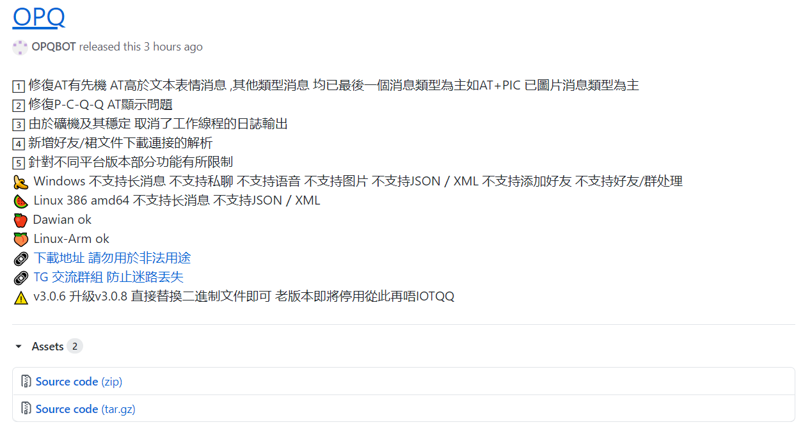
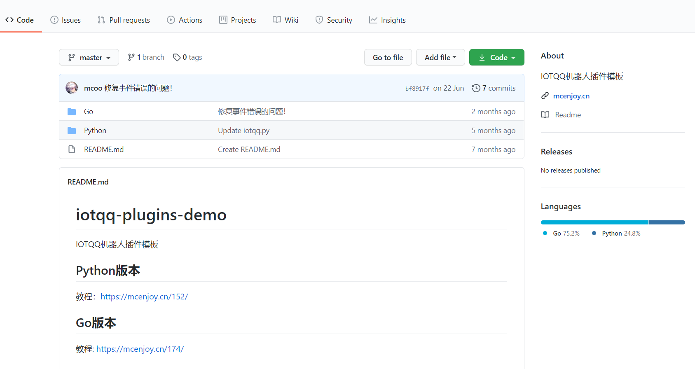

# OPQ-PyhonPlugin
OPQ机器人插件开发Python模板
今天了解到还有个OPQ的框架似乎还不错，于是研究了一下，比酷Q还方便（因为我之前用的air版，图片都发不了）

并且支持多平台，但是最新的版本居然阉割了Windows下的许多功能

不过问题不大，满足我之前的需求了。

于是参考了一下原本iot的Python模板然后进行了修改，更加符合自己的用法习惯吧。

image.png